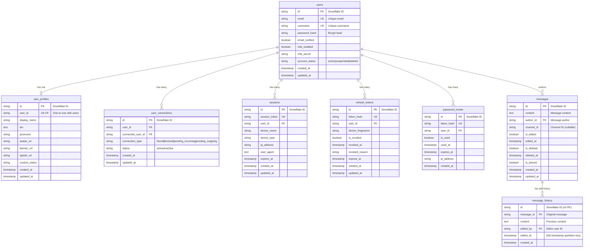

# FreedomTalk Database Schema

This document describes the complete database schema for FreedomTalk, including tables, relationships, indexes, and usage examples.

## Overview

The database uses **PostgreSQL 16** with the following key features:

- **Snowflake IDs**: Twitter-style distributed unique IDs for all primary keys
- **Foreign Key Constraints**: Enforced referential integrity with CASCADE deletes
- **Indexes**: Optimized for common query patterns
- **Timestamps**: All tables include `created_at` and `updated_at` fields
- **Check Constraints**: Data validation at the database level

## Entity Relationship Diagram



## Tables

### users

Core user authentication and account information.

**Columns:**
- `id` (string, PK): Snowflake ID
- `email` (string, unique): User email address
- `username` (string, unique): Unique username (3-32 characters)
- `password_hash` (string): Bcrypt password hash
- `email_verified` (boolean): Email verification status
- `mfa_enabled` (boolean): Multi-factor authentication enabled
- `mfa_secret` (string, nullable): TOTP secret for MFA
- `account_status` (string): Account status (active, suspended, deleted)
- `created_at` (timestamp): Creation timestamp
- `updated_at` (timestamp): Last update timestamp

**Indexes:**
- `idx_users_email` on `email`
- `idx_users_username` on `username`
- `idx_users_created_at` on `created_at`
- `idx_users_account_status` on `account_status`

**Constraints:**
- `chk_username_length`: Username must be 3-32 characters
- `chk_account_status`: Status must be 'active', 'suspended', or 'deleted'

### user_profiles

User profile information and customization (one-to-one with users).

**Columns:**
- `id` (string, PK): Snowflake ID
- `user_id` (string, FK, unique): Reference to users.id
- `display_name` (string, nullable): Display name
- `bio` (text, nullable): User biography
- `pronouns` (string, nullable): User pronouns
- `avatar_url` (string, nullable): Profile avatar URL
- `banner_url` (string, nullable): Profile banner URL
- `splash_url` (string, nullable): Profile splash/background URL
- `custom_status` (string, nullable): Custom status message
- `created_at` (timestamp): Creation timestamp
- `updated_at` (timestamp): Last update timestamp

**Indexes:**
- `idx_user_profiles_user_id` on `user_id`
- `idx_user_profiles_display_name` on `display_name`

**Foreign Keys:**
- `user_id` → `users.id` (CASCADE on delete)

### user_connections

User relationships: friends, blocks, and pending requests.

**Columns:**
- `id` (string, PK): Snowflake ID
- `user_id` (string, FK): Reference to users.id (initiator)
- `connected_user_id` (string, FK): Reference to users.id (target)
- `connection_type` (string): Type of connection
- `status` (string): Connection status (active, inactive)
- `created_at` (timestamp): Creation timestamp
- `updated_at` (timestamp): Last update timestamp

**Connection Types:**
- `friend`: Mutual friendship
- `blocked`: User has blocked connected_user
- `pending_incoming`: Incoming friend request
- `pending_outgoing`: Outgoing friend request

**Indexes:**
- `idx_user_connections_unique` (unique) on `(user_id, connected_user_id)`
- `idx_user_connections_user_id` on `user_id`
- `idx_user_connections_connected_user_id` on `connected_user_id`
- `idx_user_connections_type` on `connection_type`
- `idx_user_connections_user_type` on `(user_id, connection_type)`

**Constraints:**
- `chk_no_self_connection`: user_id != connected_user_id
- `chk_connection_type`: Type must be valid
- `chk_status`: Status must be 'active' or 'inactive'

**Foreign Keys:**
- `user_id` → `users.id` (CASCADE on delete)
- `connected_user_id` → `users.id` (CASCADE on delete)

### sessions

Active user sessions for authentication.

**Columns:**
- `id` (string, PK): Snowflake ID
- `session_token` (string, unique): Unique session token
- `user_id` (string, FK): Reference to users.id
- `device_name` (string, nullable): Device name
- `device_type` (string, nullable): Device type (mobile, desktop, etc.)
- `ip_address` (string, nullable): IP address (IPv4/IPv6)
- `user_agent` (text, nullable): Browser/client user agent
- `expires_at` (timestamp): Session expiration
- `created_at` (timestamp): Creation timestamp
- `updated_at` (timestamp): Last update timestamp

**Indexes:**
- `idx_sessions_token` on `session_token`
- `idx_sessions_user_id` on `user_id`
- `idx_sessions_expires_at` on `expires_at`
- `idx_sessions_user_expires` on `(user_id, expires_at)`

**Foreign Keys:**
- `user_id` → `users.id` (CASCADE on delete)

### refresh_tokens

Refresh tokens for JWT authentication.

**Columns:**
- `id` (string, PK): Snowflake ID
- `token_hash` (string, unique): Hashed refresh token
- `user_id` (string, FK): Reference to users.id
- `device_fingerprint` (string, nullable): Device fingerprint
- `is_revoked` (boolean): Revocation status
- `revoked_at` (timestamp, nullable): Revocation timestamp
- `revoked_reason` (string, nullable): Reason for revocation
- `expires_at` (timestamp): Token expiration
- `created_at` (timestamp): Creation timestamp
- `updated_at` (timestamp): Last update timestamp

**Indexes:**
- `idx_refresh_tokens_hash` on `token_hash`
- `idx_refresh_tokens_user_id` on `user_id`
- `idx_refresh_tokens_expires_at` on `expires_at`
- `idx_refresh_tokens_revoked` on `is_revoked`
- `idx_refresh_tokens_user_revoked` on `(user_id, is_revoked)`

**Foreign Keys:**
- `user_id` → `users.id` (CASCADE on delete)

### password_resets

Password reset tokens for account recovery.

**Columns:**
- `id` (string, PK): Snowflake ID
- `token_hash` (string, unique): Hashed reset token
- `user_id` (string, FK): Reference to users.id
- `is_used` (boolean): Usage status
- `used_at` (timestamp, nullable): Usage timestamp
- `expires_at` (timestamp): Token expiration
- `ip_address` (string, nullable): Requesting IP address
- `created_at` (timestamp): Creation timestamp

**Indexes:**
- `idx_password_resets_hash` on `token_hash`
- `idx_password_resets_user_id` on `user_id`
- `idx_password_resets_expires_at` on `expires_at`
- `idx_password_resets_used` on `is_used`
- `idx_password_resets_validation` on `(user_id, is_used, expires_at)`

**Foreign Keys:**
- `user_id` → `users.id` (CASCADE on delete)

## Snowflake IDs

All tables use Twitter-style Snowflake IDs for primary keys.

**Structure (64 bits):**
- 1 bit: Unused (always 0)
- 41 bits: Timestamp (milliseconds since epoch: 2024-01-01)
- 10 bits: Worker ID (0-1023)
- 12 bits: Sequence (0-4095)

**Benefits:**
- Globally unique across distributed systems
- Time-ordered (sortable by creation time)
- No database round-trip needed for ID generation
- 69 years of IDs from epoch
- 4096 IDs per millisecond per worker

**Usage:**
```typescript
import { generateSnowflakeId, parseSnowflakeId } from './utils/snowflake';

// Generate new ID
const userId = generateSnowflakeId();

// Parse ID to extract timestamp, worker ID, sequence
const { timestamp, workerId, sequence } = parseSnowflakeId(userId);
```

## Example Queries

### User Authentication

```sql
-- Find user by email
SELECT * FROM users WHERE email = 'alice@freedomtalk.dev';

-- Verify user credentials
SELECT id, password_hash, email_verified, mfa_enabled
FROM users
WHERE email = 'alice@freedomtalk.dev' AND account_status = 'active';

-- Get user with profile
SELECT u.*, p.display_name, p.bio, p.avatar_url
FROM users u
LEFT JOIN user_profiles p ON u.id = p.user_id
WHERE u.id = '1234567890';
```

### User Connections

```sql
-- Get all friends for a user
SELECT u.id, u.username, p.display_name, p.avatar_url
FROM user_connections uc
JOIN users u ON uc.connected_user_id = u.id
LEFT JOIN user_profiles p ON u.id = p.user_id
WHERE uc.user_id = '1234567890'
  AND uc.connection_type = 'friend'
  AND uc.status = 'active';

-- Get pending friend requests
SELECT u.id, u.username, p.display_name, p.avatar_url, uc.created_at
FROM user_connections uc
JOIN users u ON uc.user_id = u.id
LEFT JOIN user_profiles p ON u.id = p.user_id
WHERE uc.connected_user_id = '1234567890'
  AND uc.connection_type = 'pending_incoming'
  AND uc.status = 'active';

-- Check if users are friends
SELECT EXISTS(
  SELECT 1 FROM user_connections
  WHERE user_id = '1234567890'
    AND connected_user_id = '0987654321'
    AND connection_type = 'friend'
    AND status = 'active'
) AS are_friends;
```

### Session Management

```sql
-- Get active sessions for a user
SELECT * FROM sessions
WHERE user_id = '1234567890'
  AND expires_at > NOW()
ORDER BY created_at DESC;

-- Clean up expired sessions
DELETE FROM sessions WHERE expires_at < NOW();

-- Revoke all sessions for a user (logout everywhere)
DELETE FROM sessions WHERE user_id = '1234567890';
```

### Token Management

```sql
-- Get valid refresh tokens for a user
SELECT * FROM refresh_tokens
WHERE user_id = '1234567890'
  AND is_revoked = false
  AND expires_at > NOW();

-- Revoke a refresh token
UPDATE refresh_tokens
SET is_revoked = true,
    revoked_at = NOW(),
    revoked_reason = 'User logout'
WHERE token_hash = 'hashed_token_value';

-- Clean up expired/used tokens
DELETE FROM refresh_tokens WHERE expires_at < NOW();
DELETE FROM password_resets WHERE expires_at < NOW() OR is_used = true;
```

## Database Migrations

Migrations are managed using **Knex.js** with TypeScript support.

### Migration Commands

```bash
# Create a new migration
npm run migrate:make migration_name

# Run pending migrations
npm run migrate:latest

# Rollback last batch of migrations
npm run migrate:rollback

# Check migration status
npm run migrate:status

# List all migrations
npm run migrate:list
```

### Migration Best Practices

1. **Always test migrations**: Test both `up` and `down` functions
2. **Use transactions**: Migrations run in transactions by default
3. **Add indexes**: Create indexes for foreign keys and frequently queried columns
4. **Document changes**: Add comments to explain complex migrations
5. **Backward compatibility**: Consider backward compatibility when modifying existing tables

### Example Migration

```typescript
import type { Knex } from 'knex';

export async function up(knex: Knex): Promise<void> {
  await knex.schema.createTable('table_name', (table) => {
    table.string('id', 20).primary().notNullable();
    // ... other columns
    table.timestamp('created_at', { useTz: true }).defaultTo(knex.fn.now());
  });
}

export async function down(knex: Knex): Promise<void> {
  await knex.schema.dropTableIfExists('table_name');
}
```

## Database Seeding

Seeds are used to populate the database with test data for development.

### Seeding Commands

```bash
# Create a new seed file
npm run seed:make seed_name

# Run all seed files
npm run seed:run
```

### Test Users

The seed script creates 4 test users:

| Email | Username | Password | Status |
|-------|----------|----------|--------|
| alice@freedomtalk.dev | alice | TestPassword123! | Verified |
| bob@freedomtalk.dev | bob | TestPassword123! | Verified |
| charlie@freedomtalk.dev | charlie | TestPassword123! | Verified |
| diana@freedomtalk.dev | diana | TestPassword123! | Not verified |

**Relationships:**
- Alice and Bob are friends
- Alice and Charlie are friends
- Diana has sent a friend request to Alice (pending)

### Seed Safety

Seeds include safety checks:
- Only run in development environment
- Idempotent (can be run multiple times)
- Skip if data already exists

## Database Maintenance

### Regular Maintenance Tasks

#### 1. Clean Up Expired Data

```sql
-- Clean up expired sessions (run daily)
DELETE FROM sessions WHERE expires_at < NOW();

-- Clean up expired refresh tokens (run daily)
DELETE FROM refresh_tokens WHERE expires_at < NOW();

-- Clean up expired/used password resets (run daily)
DELETE FROM password_resets WHERE expires_at < NOW() OR is_used = true;
```

#### 2. Vacuum and Analyze

```sql
-- Vacuum to reclaim storage (run weekly)
VACUUM ANALYZE users;
VACUUM ANALYZE user_profiles;
VACUUM ANALYZE user_connections;
VACUUM ANALYZE sessions;
VACUUM ANALYZE refresh_tokens;
VACUUM ANALYZE password_resets;
```

#### 3. Index Maintenance

```sql
-- Reindex to optimize query performance (run monthly)
REINDEX TABLE users;
REINDEX TABLE user_profiles;
REINDEX TABLE user_connections;
REINDEX TABLE sessions;
REINDEX TABLE refresh_tokens;
REINDEX TABLE password_resets;
```

### Monitoring Queries

```sql
-- Check table sizes
SELECT
  schemaname,
  tablename,
  pg_size_pretty(pg_total_relation_size(schemaname||'.'||tablename)) AS size
FROM pg_tables
WHERE schemaname = 'public'
ORDER BY pg_total_relation_size(schemaname||'.'||tablename) DESC;

-- Check index usage
SELECT
  schemaname,
  tablename,
  indexname,
  idx_scan,
  idx_tup_read,
  idx_tup_fetch
FROM pg_stat_user_indexes
WHERE schemaname = 'public'
ORDER BY idx_scan DESC;

-- Check slow queries (requires pg_stat_statements extension)
SELECT
  query,
  calls,
  total_time,
  mean_time,
  max_time
FROM pg_stat_statements
ORDER BY mean_time DESC
LIMIT 10;
```

## Backup and Restore

See [packages/scripts/BACKUP.md](../../scripts/BACKUP.md) for detailed backup and restore procedures.

### Quick Backup

```bash
cd packages/scripts
npm run backup:db
```

### Quick Restore

```bash
pg_restore -h localhost -U postgres -d freedomtalk /path/to/backup.dump
```

## Performance Optimization

### Connection Pooling

The application uses connection pooling with the following configuration:

```env
DB_POOL_MIN=2          # Minimum connections
DB_POOL_MAX=10         # Maximum connections (development)
DB_POOL_MAX=20         # Maximum connections (production)
DB_IDLE_TIMEOUT=30000  # Idle timeout (30 seconds)
DB_CONNECTION_TIMEOUT=2000  # Connection timeout (2 seconds)
```

### Query Optimization Tips

1. **Use indexes**: All foreign keys and frequently queried columns are indexed
2. **Limit results**: Use `LIMIT` and `OFFSET` for pagination
3. **Select specific columns**: Avoid `SELECT *` in production queries
4. **Use prepared statements**: Prevent SQL injection and improve performance
5. **Batch operations**: Use bulk inserts/updates when possible
6. **Monitor slow queries**: Enable and monitor `pg_stat_statements`

### Recommended Indexes

All recommended indexes are already created by migrations:

- Primary keys (automatic)
- Foreign keys (explicit indexes)
- Unique constraints (automatic)
- Frequently queried columns (explicit indexes)
- Composite indexes for common query patterns

## Security Considerations

1. **Password hashing**: Use bcrypt with salt rounds ≥ 10
2. **Token hashing**: Hash all tokens before storing in database
3. **SQL injection**: Use parameterized queries (Knex handles this)
4. **Access control**: Implement row-level security if needed
5. **Encryption**: Consider encrypting sensitive columns (e.g., mfa_secret)
6. **Audit logging**: Log all authentication and authorization events
7. **Rate limiting**: Implement rate limiting for authentication endpoints

### `messages` Table

Stores all messages sent in channels and direct messages.

**Schema:**

| Column | Type | Constraints | Description |
|--------|------|-------------|-------------|
| `id` | `VARCHAR(20)` | PRIMARY KEY | Snowflake ID |
| `content` | `TEXT` | NOT NULL | Message content (max 2000 chars) |
| `author_id` | `VARCHAR(20)` | NOT NULL, FK → users(id) CASCADE | Message author |
| `channel_id` | `VARCHAR(20)` | NULLABLE | Channel ID (null for DMs) |
| `is_edited` | `BOOLEAN` | DEFAULT false | Whether message was edited |
| `edited_at` | `TIMESTAMPTZ` | NULLABLE | Last edit timestamp |
| `is_deleted` | `BOOLEAN` | DEFAULT false | Soft delete flag |
| `deleted_at` | `TIMESTAMPTZ` | NULLABLE | Deletion timestamp |
| `is_pinned` | `BOOLEAN` | DEFAULT false | Pin status |
| `created_at` | `TIMESTAMPTZ` | DEFAULT NOW() | Creation timestamp |
| `updated_at` | `TIMESTAMPTZ` | DEFAULT NOW() | Last update timestamp |

**Indexes:**
- `idx_messages_author_id` on `author_id`
- `idx_messages_channel_id` on `channel_id`
- `idx_messages_created_at` on `created_at`
- `idx_messages_channel_created` on `(channel_id, created_at)` (composite for pagination)
- `idx_messages_is_deleted` on `is_deleted`

**Foreign Keys:**
- `author_id` → `users(id)` ON DELETE CASCADE

**Example Queries:**

```sql
-- Get recent messages in a channel
SELECT m.*, u.username, u.avatar_url
FROM messages m
JOIN users u ON m.author_id = u.id
WHERE m.channel_id = '1234567890123456789'
  AND m.is_deleted = false
ORDER BY m.created_at DESC
LIMIT 50;

-- Get messages with cursor-based pagination
SELECT m.*, u.username
FROM messages m
JOIN users u ON m.author_id = u.id
WHERE m.channel_id = '1234567890123456789'
  AND m.is_deleted = false
  AND m.id < '1234567890123456789'  -- cursor
ORDER BY m.created_at DESC
LIMIT 50;

-- Search messages by content
SELECT m.*, u.username
FROM messages m
JOIN users u ON m.author_id = u.id
WHERE m.channel_id = '1234567890123456789'
  AND m.is_deleted = false
  AND m.content ILIKE '%search term%'
ORDER BY m.created_at DESC;

-- Get pinned messages
SELECT m.*, u.username
FROM messages m
JOIN users u ON m.author_id = u.id
WHERE m.channel_id = '1234567890123456789'
  AND m.is_pinned = true
  AND m.is_deleted = false
ORDER BY m.created_at DESC;
```

---

### `message_history` Table (TimescaleDB Hypertable)

Stores edit history for messages using TimescaleDB for efficient time-series storage and automatic partitioning.

**Schema:**

| Column | Type | Constraints | Description |
|--------|------|-------------|-------------|
| `id` | `VARCHAR(20)` | NOT NULL | Snowflake ID (no PK due to hypertable) |
| `message_id` | `VARCHAR(20)` | NOT NULL, FK → messages(id) CASCADE | Original message ID |
| `content` | `TEXT` | NOT NULL | Previous message content |
| `edited_by` | `VARCHAR(20)` | NOT NULL, FK → users(id) CASCADE | User who made the edit |
| `edited_at` | `TIMESTAMPTZ` | NOT NULL | Edit timestamp (partitioning column) |
| `created_at` | `TIMESTAMPTZ` | DEFAULT NOW() | Record creation timestamp |

**Indexes:**
- `idx_message_history_id` on `id`
- `idx_message_history_message_id` on `message_id`
- `idx_message_history_edited_at` on `edited_at`

**TimescaleDB Configuration:**
- Hypertable partitioned by `edited_at`
- Automatic time-based partitioning
- Optimized for time-series queries

**Foreign Keys:**
- `message_id` → `messages(id)` ON DELETE CASCADE
- `edited_by` → `users(id)` ON DELETE CASCADE

**Important Notes:**
- This table uses TimescaleDB's hypertable feature for automatic partitioning
- The `id` field does NOT have a PRIMARY KEY constraint because TimescaleDB requires all unique indexes to include the partitioning column (`edited_at`)
- History records are append-only and should never be updated or deleted manually

**Example Queries:**

```sql
-- Get edit history for a message
SELECT h.*, u.username as editor_username
FROM message_history h
JOIN users u ON h.edited_by = u.id
WHERE h.message_id = '1234567890123456789'
ORDER BY h.edited_at DESC;

-- Get all edits in a time range
SELECT h.*, m.content as current_content, u.username
FROM message_history h
JOIN messages m ON h.message_id = m.id
JOIN users u ON h.edited_by = u.id
WHERE h.edited_at BETWEEN '2026-01-01' AND '2026-01-31'
ORDER BY h.edited_at DESC;

-- Count edits per message
SELECT message_id, COUNT(*) as edit_count
FROM message_history
GROUP BY message_id
ORDER BY edit_count DESC
LIMIT 10;
```

---

## Troubleshooting

### Common Issues

#### Migration Failed

```bash
# Check migration status
npm run migrate:status

# Rollback last migration
npm run migrate:rollback

# Fix the migration file and try again
npm run migrate:latest
```

#### Connection Pool Exhausted

```bash
# Check active connections
SELECT count(*) FROM pg_stat_activity WHERE datname = 'freedomtalk';

# Increase pool size in .env
DB_POOL_MAX=20
```

#### Slow Queries

```bash
# Enable query logging in PostgreSQL
ALTER DATABASE freedomtalk SET log_min_duration_statement = 1000;

# Check slow queries
SELECT * FROM pg_stat_statements ORDER BY mean_time DESC LIMIT 10;
```

## Additional Resources

- [PostgreSQL Documentation](https://www.postgresql.org/docs/16/)
- [Knex.js Documentation](https://knexjs.org/)
- [Snowflake ID Specification](https://github.com/twitter-archive/snowflake)
- [Database Backup Guide](../../scripts/BACKUP.md)


